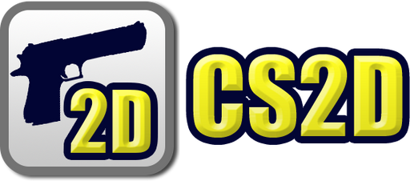
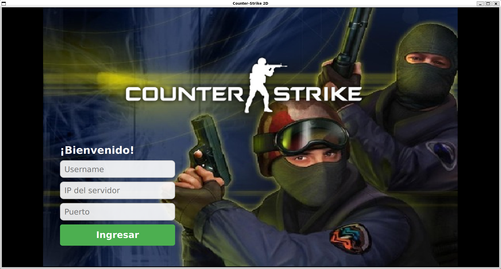
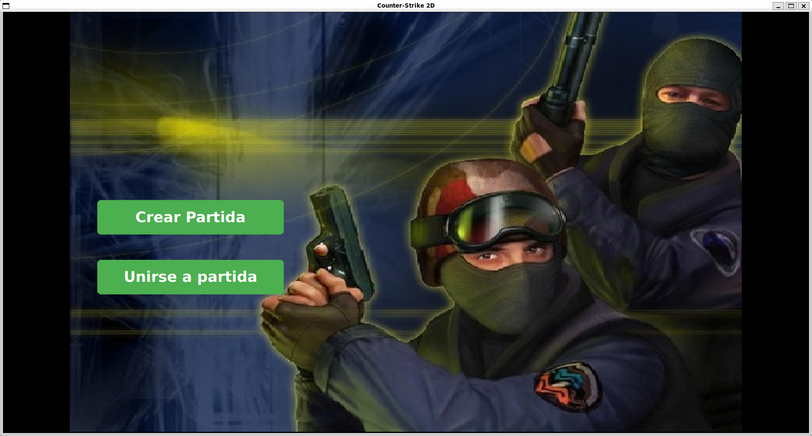
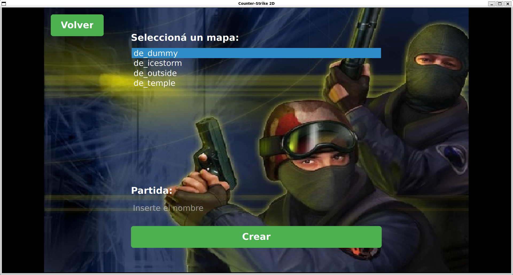
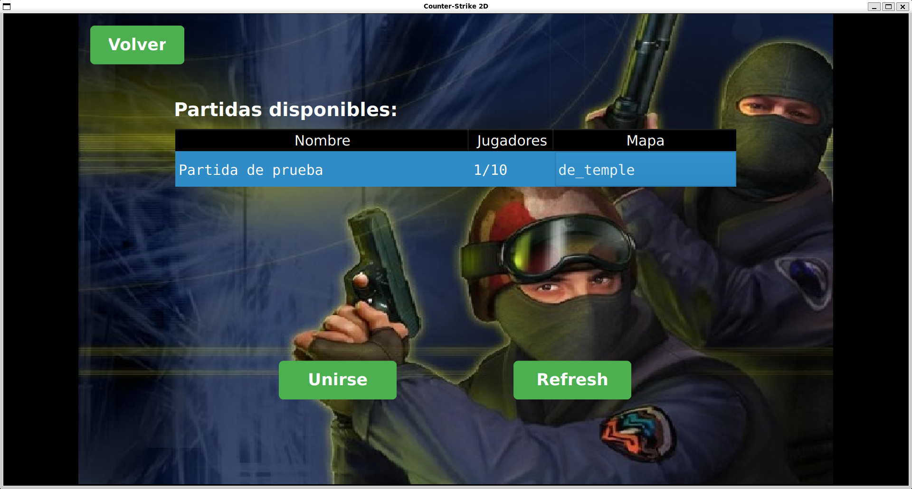
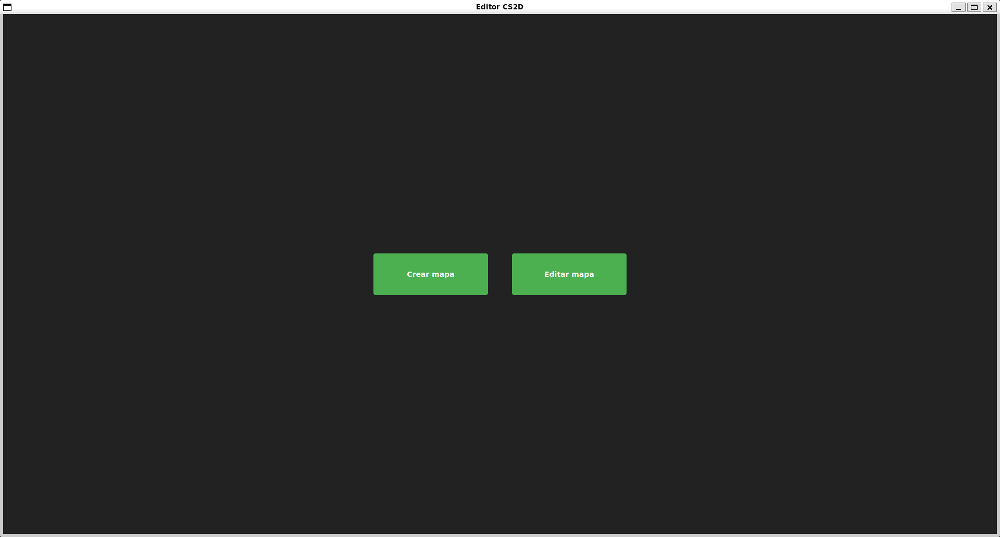
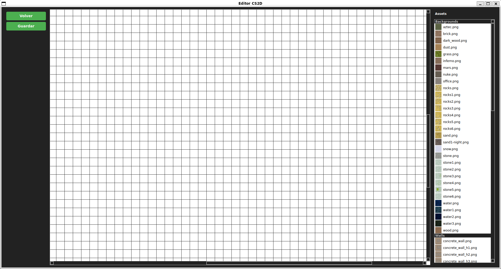

# Counter Strike 2D

<div align="center">
  
</div>

## Descripción

Counter Strike 2D es un juego multijugador en 2D inspirado en Counter-Strike. Permite a los jugadores crear y unirse a partidas, jugar en diferentes mapas, y utilizar un editor de mapas integrado para crear nuevos niveles.

## Índice

- [Características](#características)
- [Requisitos del Sistema](#requisitos-del-sistema)
- [Instalación](#instalación)
- [Guía de Uso](#guía-de-uso)
  - [Servidor](#servidor)
  - [Cliente](#cliente)
    - [Controles](#controles-del-juego)
  - [Editor de Mapas](#editor-de-mapas)
    - [Controles](#funcionalidades-del-editor)
- [Estructura del Proyecto](#estructura-del-proyecto)
- [Documentación](#documentación)
- [Créditos](#créditos)
- [Licencia](#licencia)

## Características

- **Juego multijugador**: Soporte para múltiples jugadores simultáneos
- **Editor de mapas**: Herramienta integrada para crear mapas personalizados
- **Múltiples mapas**: Variedad de mapas predefinidos
- **Sistema de armas**: Diferentes armas con características únicas
- **Modo CT vs TT**: Equipos Counter-Terrorist vs Terrorist
- **Interfaz gráfica**: Cliente con interfaz Qt

## Requisitos del Sistema

### Dependencias

- **Sistema Operativo**: Ubuntu 24.04 LTS (recomendado)
- **Compilador**: GCC 11+
- **CMake**: 3.20+
- **Qt5**: 5.15+
- **SDL2**: 2.28+
- **YAML-CPP**: 0.7+

## Instalación

```bash
# Es para dar los permisos de ejecución
chmod +x cs2d_setup.sh
```

```bash
# Para ejecutar el instalador
./cs2d_setup.sh
```

**El instalador automático:**

- Descarga e instala todas las dependencias (SDL2, Qt5, yaml-cpp, etc.)
- Compila el proyecto completo
- Ejecuta tests unitarios
- Instala binarios en `/usr/bin/`
- Instala assets en `/var/cs2d/`
- Instala configuración en `/etc/cs2d/`
- Configura permisos de ejecución automáticamente

**Nota:** El instalador requiere permisos de administrador para instalar en el sistema.

## Guía de Uso

### Servidor

Para ejecutar el servidor:

```bash
cs2d_server <puerto>
```

**Comandos del servidor:**

- Presionar `q` para cerrar el servidor
- El servidor cargará automáticamente los mapas disponibles

**Ejemplo:**

```bash
cs2d_server 8080
```

### Cliente

Para ejecutar el cliente:

```bash
cs2d_client
```

O hacerle doble click al archivo.

#### Pantalla de Conexión

La pantalla de bienvenida solicita:

- **Username**: Nombre del jugador
- **IP**: Dirección del servidor
- **Puerto**: Puerto del servidor



#### Lobby Principal

Una vez conectado, puedes elegir entre crear una nueva partida o unirte a una existente.



#### Crear Partida

Al crear una partida puedes:

- Seleccionar entre todos los mapas disponibles
- Asignar un nombre personalizado a la partida



#### Unirse a Partida

Para unirte a una partida existente:

- Selecciona la partida de la lista disponible
- El sistema te asignará automáticamente un equipo (CT/TT)



#### Controles del juego

| Acción | Descripción |
|--------|-------------|
| **Click izquierdo** | Disparar / Colocar Bomba |
| **WASD** | Movimiento |
| **B** | Abrir tienda |
| **G** | Tirar arma |
| **R** | Recargar arma |
| **1-2-3-4** | Cambio de arma |
| **E** | Desactivar bomba |
| **Esc** | Menu de salida |
| **Tab** | Menu de stats |
| **,** | Comprar balas de arma principal |
| **.** | Comprar balas de arma secundaria |

### Editor de Mapas

Para ejecutar el editor:

```bash
cs2d_editor
```

O hacerle doble click al archivo.

#### Pantalla Principal

Al iniciar el editor verás la ventana principal:



#### Interfaz del Editor

La interfaz del editor incluye una grilla de edición y panel de assets:



#### Funcionalidades del Editor

| Acción | Descripción |
|--------|-------------|
| **Click izquierdo** | Coloca el asset seleccionado en la celda |
| **Arrastrar asset** | Coloca el asset en la celda donde lo sueltes |
| **Click derecho** | Elimina el asset de la celda |
| **Click y arrastrar (izquierdo)** | Pinta varias celdas seguidas |
| **Click y arrastrar (derecho)** | Borra varias celdas seguidas |
| **Click con ruedita** | Selecciona automáticamente el asset de la celda |
| **Ctrl + ruedita** | Zoom in/out en la grilla |

## Estructura del Proyecto

```bash
Counter-Strike-2D/
├── assets/          # Recursos gráficos y de sonido
├── client/          # Código del cliente Qt y SDL
├── common/          # Código compartido entre cliente y servidor
├── docs/            # Documentación del proyecto
├── editor/          # Editor de mapas Qt
├── server/          # Código del servidor
├── tests/           # Tests unitarios
├── cs2d_setup.sh    # Instalador del juego
```

## Documentación

- **[Documentación Técnica](docs/Documentación%20Técnica.md)**: Arquitectura y estructura técnica del servidor
- **[Manual del Proyecto](docs/manual%20del%20proyecto.md)**: Documentación de organización del proyecto

## Créditos

### Desarrolladores

- [Camila Mantilla](https://github.com/milamantilla00)
- [Jonathan Dominguez](https://github.com/dominguez-j)
- [Marcos Navarro](https://github.com/NVRar)
- [Mateo Serrano](https://github.com/Mateo-Serrano-2004)

### Corrector

- [Mateo Capon](https://github.com/mateocapon)

### Librerías Utilizadas

- **[Librería de sockets](https://github.com/eldipa/sockets-en-cpp)** (GPL v2) - Autor: **@eldipa**
- **[Thread](https://github.com/eldipa/hands-on-threads/blob/master/libs/thread.h)** (GPL v2) - Autor: **@eldipa**
- **[Queue](https://github.com/eldipa/hands-on-threads/blob/master/libs/queue.h)** (GPL v2) - Autor: **@eldipa**

## Licencia

Este proyecto está licenciado bajo **GPL v2**.
