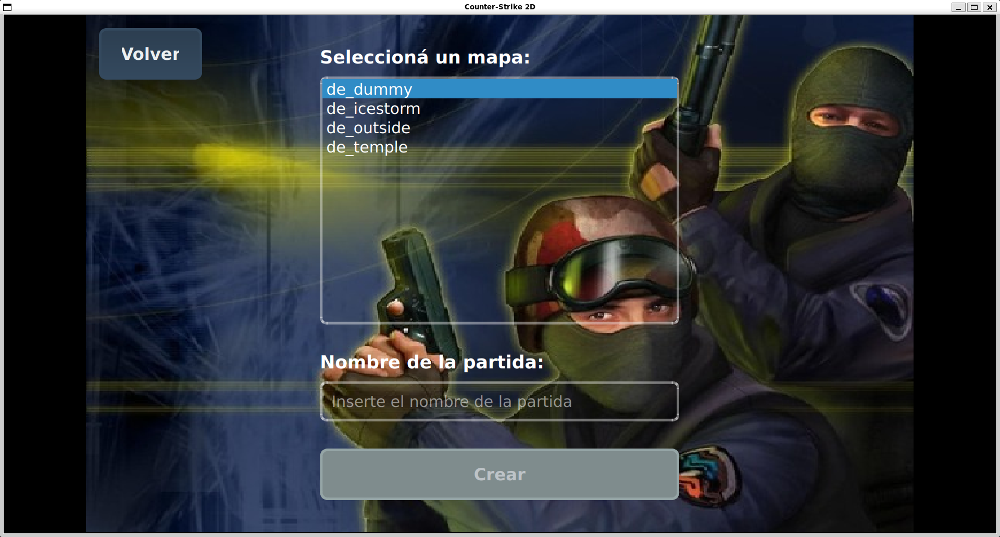

# Counter Strike 2D

## Guía rápida para levantar el servidor

Para poder ejecutar el servidor se debe de hacer:

```bash
cs2d_server <port>
```

Y en caso de querer cerrarlo solo se debe de ingresar la tecla "q".

## Guía rápida para el cliente

Para ejecutar el cliente:

```bash
cs2d_client
```

La pantalla de bienvenida te va a pedir que ingreses el username, la ip y el puerto.


Una vez dentro vas a poder elegir entre crear y unirte a una partida.


Cuando quieras crear una partida vas a poder ver todos los mapas disponibles, para seleccionar y luego ponerle nombre a la partida.



En caso de que quieras unirte a una partida existente, tocas el otro botón y seleccionas la partida a la que te quieras unir.


## Guía rápida del Editor de Mapas

Para ejecutar el editor:

```bash
cs2d_editor
```

Apenas se inicia el editor se podrá ver una ventana como esta:


Una vez se ingresa, pasaremos a ver esta otra:


Y que cuenta con estas funcionalidades:

- **Click izquierdo sobre la grilla:** Coloca el asset seleccionado en la celda.
- **Arrastrar asset desde la lista a la grilla:** Coloca el asset en la celda donde lo sueltes.
- **Click derecho sobre la grilla:** Elimina el asset de la celda.
- **Click y arrastrar (manteniendo click izquierdo) sobre la grilla:** Pinta varias celdas seguidas con el asset seleccionado.
- **Click y arrastrar (manteniendo click derecho) sobre la grilla:** Borra varias celdas seguidas.
- **Click con la ruedita del mouse sobre la grilla:** Selecciona automáticamente el asset que está en esa celda (lo marca en la lista de la derecha).
- **Mantener Ctrl y girar la ruedita del mouse sobre la grilla:** Hace zoom in/out en la grilla.

## Créditos

[Librería de sockets](https://github.com/eldipa/sockets-en-cpp) (GPL v2) - Autor: **@eldipa**

[Thread](https://github.com/eldipa/hands-on-threads/blob/master/libs/thread.h) (GPL v2) - Autor: **@eldipa**

[Queue](https://github.com/eldipa/hands-on-threads/blob/master/libs/queue.h) (GPL v2) - Autor: **@eldipa**

## Licencia

GPL v2
