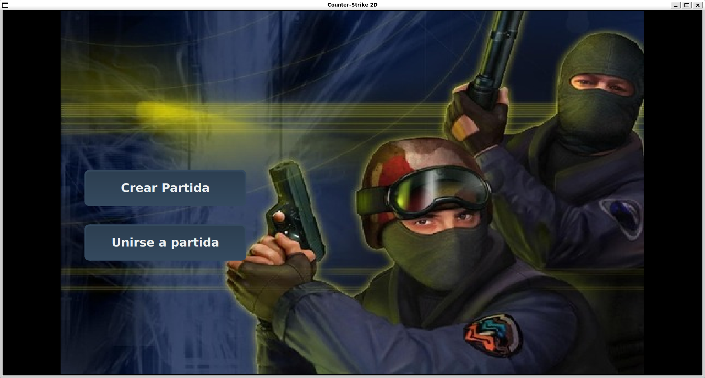

# Counter Strike 2D

<div align="center">
  
</div>

## Descripción

Counter Strike 2D es un juego multijugador en 2D inspirado en Counter-Strike. Permite a los jugadores crear y unirse a partidas, jugar en diferentes mapas, y utilizar un editor de mapas integrado para crear nuevos niveles.

## Características

- **Juego multijugador**: Soporte para múltiples jugadores simultáneos
- **Editor de mapas**: Herramienta integrada para crear mapas personalizados
- **Múltiples mapas**: Variedad de mapas predefinidos
- **Sistema de armas**: Diferentes armas con características únicas
- **Modo CT vs TT**: Equipos Counter-Terrorist vs Terrorist
- **Interfaz gráfica**: Cliente con interfaz Qt

## Requisitos del Sistema

### Dependencias
- **CMake** (versión 3.10 o superior)
- **Qt5** (para el cliente y editor)
- **yaml-cpp** (para parsing de configuración)
- **Compilador C++** compatible con C++17

### Sistema Operativo
- Linux (desarrollado y probado en Ubuntu/WSL2)

## Guía de Instalación

El proyecto incluye un instalador automático que configura todo el entorno del sistema para Ubuntu 24.04 LTS:

### Opción 1: Doble Click (Recomendado)
- **Doble click en**: "Instalar Counter Strike 2D.desktop"
- **O doble click en**: "Desinstalar Counter Strike 2D.desktop" (para desinstalar)

**Si los archivos .desktop no funcionan:**
1. Click derecho en el archivo `.desktop`
2. Seleccionar "Propiedades"
3. En la pestaña "Permisos", marcar "Permitir ejecutar como programa"
4. Hacer doble click nuevamente

### Opción 2: Desde Terminal
```bash
# Instalar (requiere permisos de administrador)
sudo ./installers/install.sh

# Desinstalar (requiere permisos de administrador)
sudo ./installers/uninstall.sh
```

**El instalador automático:**
- Descarga e instala todas las dependencias (SDL2, Qt5, yaml-cpp, etc.)
- Compila el proyecto completo
- Ejecuta tests unitarios
- Instala binarios en `/usr/bin/`
- Instala assets en `/var/cs2d/`
- Instala configuración en `/etc/cs2d/`
- Genera accesos directos en el escritorio
- Configura permisos de ejecución automáticamente

**Nota:** El instalador requiere permisos de administrador para instalar en el sistema.

## Guía de Uso

### Servidor

Para ejecutar el servidor:

```bash
cs2d_server <puerto>
```

**Comandos del servidor:**
- Presionar `q` para cerrar el servidor
- El servidor cargará automáticamente los mapas disponibles

**Ejemplo:**
```bash
cs2d_server 8080
```

### Cliente

Para ejecutar el cliente:

```bash
cs2d_client
```

#### Pantalla de Conexión
La pantalla de bienvenida solicita:
- **Username**: Nombre del jugador
- **IP**: Dirección del servidor
- **Puerto**: Puerto del servidor


#### Lobby Principal
Una vez conectado, puedes elegir entre crear una nueva partida o unirte a una existente.



#### Crear Partida
Al crear una partida puedes:
- Seleccionar entre todos los mapas disponibles
- Asignar un nombre personalizado a la partida


#### Unirse a Partida
Para unirte a una partida existente:
- Selecciona la partida de la lista disponible
- El sistema te asignará automáticamente un equipo (CT/TT)


### Editor de Mapas

Para ejecutar el editor:

```bash
cs2d_editor
```

#### Pantalla Principal
Al iniciar el editor verás la ventana principal:


#### Interfaz del Editor
La interfaz del editor incluye una grilla de edición y panel de assets:


#### Funcionalidades del Editor

| Acción | Descripción |
|--------|-------------|
| **Click izquierdo** | Coloca el asset seleccionado en la celda |
| **Arrastrar asset** | Coloca el asset en la celda donde lo sueltes |
| **Click derecho** | Elimina el asset de la celda |
| **Click y arrastrar (izquierdo)** | Pinta varias celdas seguidas |
| **Click y arrastrar (derecho)** | Borra varias celdas seguidas |
| **Click con ruedita** | Selecciona automáticamente el asset de la celda |
| **Ctrl + ruedita** | Zoom in/out en la grilla |

## Estructura del Proyecto

```
Counter-Strike-2D/
├── assets/          # Recursos gráficos y de sonido
├── client/          # Código del cliente Qt y SDL
├── common/          # Código compartido entre cliente y servidor
├── docs/            # Documentación del proyecto
├── editor/          # Editor de mapas Qt
├── installers/      # Scripts de instalación
│   ├── install.sh   # Instalador automático
│   └── uninstall.sh # Desinstalador
├── server/          # Código del servidor
├── tests/           # Tests unitarios
├── Instalar Counter Strike 2D.desktop      # Acceso directo instalador
└── Desinstalar Counter Strike 2D.desktop   # Acceso directo desinstalador
```

## Documentación

- **[Documentación Técnica](docs/Documentación%20Técnica.md)**: Arquitectura y estructura técnica del servidor
- **[Manual del Proyecto](docs/Manual%20del%20Proyecto.md)**: Documentación de organización del proyecto

## Créditos

### Librerías Utilizadas
- **[Librería de sockets](https://github.com/eldipa/sockets-en-cpp)** (GPL v2) - Autor: **@eldipa**
- **[Thread](https://github.com/eldipa/hands-on-threads/blob/master/libs/thread.h)** (GPL v2) - Autor: **@eldipa**
- **[Queue](https://github.com/eldipa/hands-on-threads/blob/master/libs/queue.h)** (GPL v2) - Autor: **@eldipa**

## Licencia

Este proyecto está licenciado bajo **GPL v2**.
